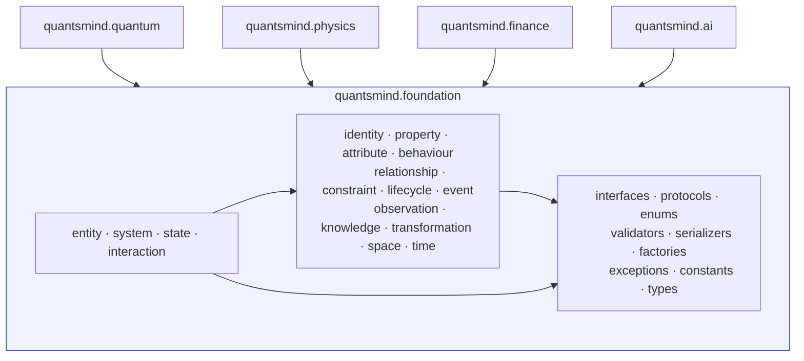
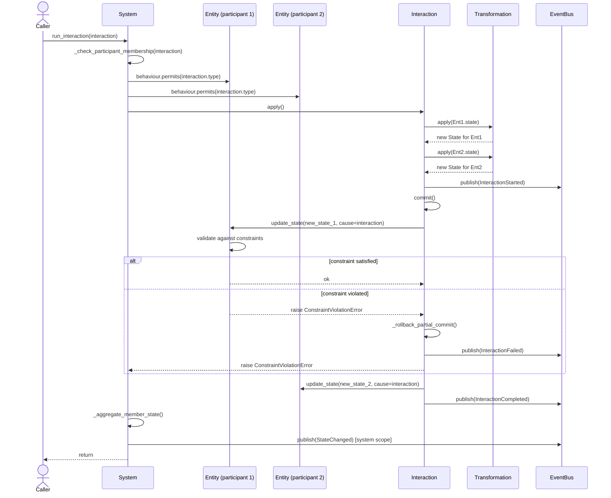
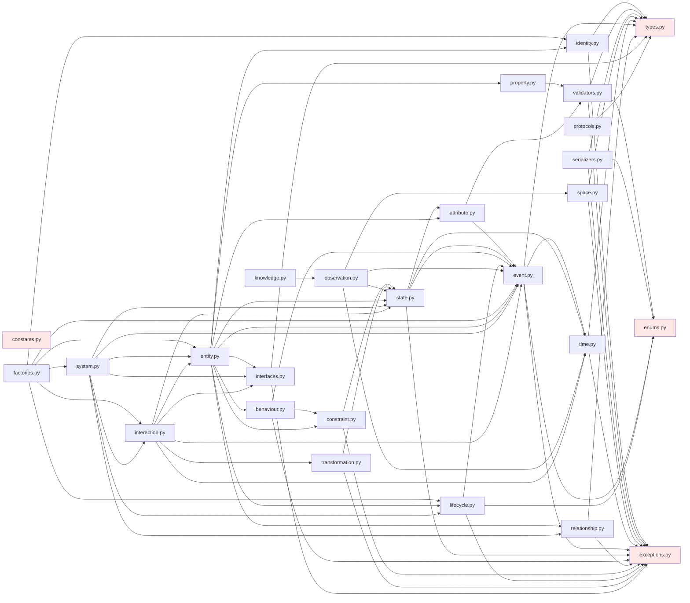

# UML Diagrams

Rendered as Mermaid so they display directly on GitHub/most Markdown
viewers. These are descriptive architecture diagrams, not
implementation-generated — keep them in sync with the class specs by
hand when the spec changes.

## 1. Package Diagram



## 2. Class Diagram (core ontology)

```mermaid
classDiagram
    class Entity {
        +EntityId id
        +str name
        +dict~str,Property~ properties
        +dict~str,Attribute~ attributes
        +State state
        +list~State~ history
        +list~Relationship~ relationships
        +list~Constraint~ constraints
        +Behaviour behaviour
        +Lifecycle lifecycle
        +create()
        +initialize()
        +activate()
        +update_state(new_state)
        +interact(interaction)
        +clone()
        +observe()
        +validate()
    }

    class System {
        +dict~EntityId,Entity~ entities
        +list~Relationship~ relationships
        +State state
        +list~Constraint~ constraints
        +Lifecycle lifecycle
        +add_entity(entity)
        +run_interaction(interaction)
        +find_entity()
        +validate()
    }

    class State {
        +StateId id
        +EntityId owner_id
        +Mapping~str,AttributeValue~ values
        +Time timestamp
        +InteractionId cause
        +diff(other)
        +merge(other)
        +validate(constraints)
    }

    class Interaction {
        +InteractionId id
        +str type
        +list~EntityId~ participants
        +Transformation transformation
        +InteractionStatus status
        +dict~EntityId,State~ results
        +apply()
        +commit()
        +cancel()
    }

    class Identity
    class Property
    class Attribute
    class Behaviour
    class Relationship
    class Constraint
    class Lifecycle
    class Event
    class Observation
    class Knowledge
    class Transformation
    class Space
    class Time

    Entity "1" *-- "1" Identity
    Entity "1" *-- "1" State : current
    Entity "1" *-- "0..*" State : history
    Entity "1" *-- "0..*" Property
    Entity "1" *-- "0..*" Attribute
    Entity "1" *-- "0..*" Relationship
    Entity "1" *-- "0..*" Constraint
    Entity "1" *-- "1" Behaviour
    Entity "1" *-- "1" Lifecycle

    System "1" o-- "0..*" Entity
    System "1" *-- "0..*" Relationship
    System "1" *-- "0..*" Constraint
    System "1" *-- "1" Lifecycle

    Interaction "1" --> "1..*" Entity : participants
    Interaction "1" *-- "1" Transformation
    Interaction "1" ..> "0..*" State : produces

    State ..> Time : timestamped by
    State "0..1" --> "0..1" Interaction : caused by

    Observation "1" --> "1" State : measures
    Observation "1" --> "1" Space
    Observation "1" ..> Knowledge : contributes to

    Relationship "1" --> "2..*" Entity : connects

    <<interface>> Identifiable
    <<interface>> Observable
    <<interface>> Serializable
    <<interface>> Cloneable
    <<interface>> Validatable
    <<interface>> Comparable
    <<interface>> Timestamped

    Entity ..|> Identifiable
    Entity ..|> Observable
    Entity ..|> Serializable
    Entity ..|> Cloneable
    Entity ..|> Validatable
    Entity ..|> Comparable
    Entity ..|> Timestamped

    System ..|> Identifiable
    System ..|> Observable
    System ..|> Serializable
    System ..|> Cloneable
    System ..|> Validatable
    System ..|> Comparable
    System ..|> Timestamped

    State ..|> Serializable
    State ..|> Comparable
    State ..|> Timestamped

    Interaction ..|> Identifiable
    Interaction ..|> Observable
    Interaction ..|> Serializable
    Interaction ..|> Comparable
    Interaction ..|> Timestamped
```

## 3. Sequence Diagram — Running an Interaction inside a System



## 4. Dependency Diagram (foundation modules)



The four modules highlighted in red (`exceptions`, `types`, `enums`,
`constants`) are the only modules with **zero** internal foundation
dependencies — every other module depends on at least one of them,
directly or transitively, and there are no cycles.
